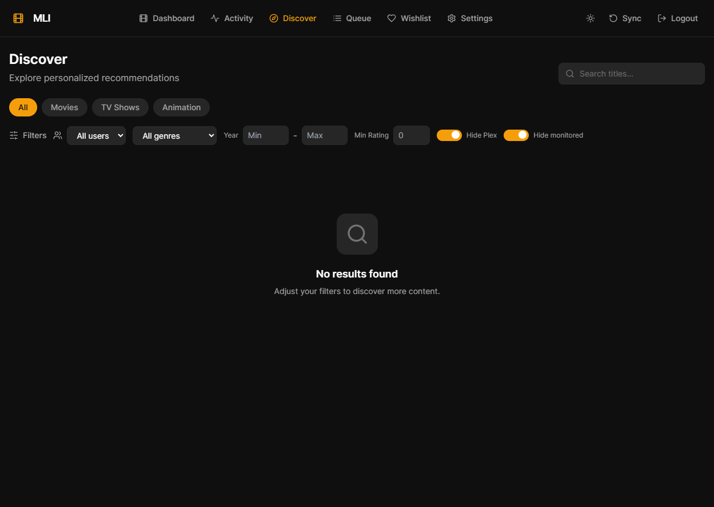

# 🎬 Media Library Intelligence

<p align="center">
  <strong>Découvrez, organisez et enrichissez votre bibliothèque Plex intelligemment.</strong>
</p>

<p align="center">
  <a href="#-fonctionnalités">Fonctionnalités</a> •
  <a href="#-démarrage-rapide">Démarrage rapide</a> •
  <a href="#-configuration">Configuration</a> •
  <a href="#-architecture">Architecture</a> •
  <a href="#-développement">Développement</a>
</p>

<p align="center">
  
  
  
  
  
  
  
</p>

---

<p align="center">
  
  <br>
  <em>Page Discover — recommandations personnalisées et filtres intelligents</em>
</p>

## ✨ Fonctionnalités

| | |
|:---|:---|
| 🧠 **Recommandations intelligentes** | Score 0-100 basé sur trois piliers : sagas incomplètes, goûts des utilisateurs et classiques manquants. |
| 🔍 **Recherche globale** | Barre de recherche dans la navbar pour trouver instantanément un titre dans toute la base. |
| 🎨 **Discover immersif** | Grille responsive de posters, fiches détaillées, bandes-annonces et fournisseurs de streaming. |
| 📚 **Gestion des sagas** | Détection automatique des collections TMDB et suggestions pour compléter une série de films. |
| ⚡ **Actions rapides** | Ajout direct à **Radarr** (films) ou **Sonarr** (séries), ou mise en liste de souhaits. |
| 📦 **File de téléchargement** | Suivi en temps réel des demandes Radarr/Sonarr et de leur état d'avancement. |
| 💖 **Wishlist actionnable** | Liste de souhaits avec envoi direct vers Radarr/Sonarr d'un seul clic. |
| 🚫 **Exclusions strictes** | Horreur, adulte, hentai/ecchi automatiquement filtrés. |
| 🔄 **Synchronisation Plex** | Scan complet de la bibliothèque avec extraction des GUIDs externes (TMDb, TVDb, IMDb). |
| ⚙️ **Configuration 100 % web** | URLs et clés API renseignées directement dans l'interface, stockées chiffrées en base. |

## 🚀 Démarrage rapide

### Prérequis

- [Docker](https://www.docker.com/)
- [Docker Compose](https://docs.docker.com/compose/)

### 1. Cloner le projet

```bash
git clone <url-du-repo>
cd media_library_intelligence
```

### 2. Lancer la stack

```bash
docker compose up --build -d
```

> La première build compile le frontend React et installe les dépendances Python.

### 3. Ouvrir l'application

Rendez-vous sur : **http://localhost:3000**

Identifiants par défaut :

- **Utilisateur** : `admin`
- **Mot de passe** : `admin`

> Pensez à changer le mot de passe admin dans les Settings dès le premier lancement.

## ⚙️ Configuration

Une fois l'application lancée, cliquez sur **Settings** (icône ⚙️ dans la navbar) et renseignez vos connecteurs :

| Plateforme | Champs requis | Où trouver la clé |
|------------|---------------|-------------------|
| **Plex** | URL du serveur, Token X-Plex | Plex Web → Paramètres → Général → Avancé → Afficher le token |
| **Tautulli** | URL, API Key | Tautulli → Settings → Web Interface → API |
| **TMDB** | API Key | [themoviedb.org/settings/api](https://www.themoviedb.org/settings/api) |
| **Sonarr** | URL, API Key | Sonarr → Settings → General → Security |
| **Radarr** | URL, API Key | Radarr → Settings → General → Security |
| **AniList** | Client ID (optionnel) | [anilist.co/settings/developer](https://anilist.co/settings/developer) |

Après avoir sauvegardé :

1. Allez sur le **Dashboard**.
2. Cliquez sur **Sync** pour lancer un scan complet de votre bibliothèque Plex.
3. Retournez sur **Discover** pour explorer vos recommandations.

> 🔐 **Sécurité** : les clés API et tokens sont stockés chiffrés dans PostgreSQL et jamais exposés côté client.

## 🏗️ Architecture

```
┌─────────────────┐      ┌─────────────────┐      ┌─────────────────┐
│    Frontend     │◄────►│    FastAPI      │◄────►│   PostgreSQL    │
│  React + Vite   │      │    Backend      │      │     + Redis     │
│ TailwindCSS +   │      │   SQLAlchemy    │      │                 │
│   React Query   │      │  Celery + JWT   │      │                 │
└─────────────────┘      └─────────────────┘      └─────────────────┘
                                │
           ┌────────────────────┼────────────────────┐
           ▼                    ▼                    ▼
      ┌─────────┐         ┌───────────┐        ┌───────────┐
      │  TMDB   │         │  AniList  │        │   Plex    │
      └─────────┘         └───────────┘        ├───────────┤
                                               │ Tautulli  │
                                               │  Sonarr   │
                                               │  Radarr   │
                                               └───────────┘
```

### Services Docker

| Service | Rôle | Port exposé |
|---------|------|-------------|
| `app` | Backend FastAPI + frontend servé en statique | `3000` |
| `worker` | Workers Celery pour les tâches longues | — |
| `scheduler` | Celery Beat pour les tâches planifiées | — |
| `db` | PostgreSQL 17 | `5432` (interne) |
| `redis` | Redis 7.4 (broker Celery + cache) | `6379` (interne) |

## 📁 Structure du projet

```
media_library_intelligence/
├── docker-compose.yml          # Stack complète Docker
├── .env.example                # Variables d'environnement minimales
├── app/
│   ├── Dockerfile              # Build multi-étapes Node + Python
│   ├── backend/
│   │   ├── main.py             # Point d'entrée FastAPI
│   │   ├── app/
│   │   │   ├── connectors/     # Plex, Tautulli, TMDB, AniList, Sonarr, Radarr
│   │   │   ├── routers/        # Endpoints API (/api/...)
│   │   │   ├── services/       # Logique métier & settings chiffrés
│   │   │   ├── tasks/          # Tâches Celery
│   │   │   ├── models.py       # Modèles SQLAlchemy
│   │   │   └── schemas.py      # Schémas Pydantic
│   │   ├── tests/              # Tests backend (pytest)
│   │   └── alembic/            # Migrations de base de données
│   └── frontend/
│       ├── src/
│       │   ├── components/     # Composants réutilisables
│       │   ├── pages/          # Dashboard, Discover, Queue, Wishlist, Settings, Media
│       │   └── hooks/          # React Query hooks
│       └── package.json
└── README.md
```

## 🔄 Tâches planifiées (Celery Beat)

| Tâche | Fréquence | Description |
|-------|-----------|-------------|
| `refresh_external_classics` | Hebdomadaire | Récupère les films/séries/animes populaires et bien notés sur TMDB et AniList. |
| `sync_plex_library` | Manuelle / au démarrage | Scan complet de la bibliothèque Plex avec extraction des GUIDs externes. |
| `sync_tautulli_stats` | Manuelle | Récupère les statistiques de visionnage Tautulli. |

## 🛠️ Développement

### Lancer les tests

**Backend :**

```bash
docker compose --env-file .env run --rm --no-deps worker python -m pytest tests/ -v
```

**Frontend :**

```bash
cd app/frontend
npm test
```

### Rebuild après modification

```bash
docker compose build app worker scheduler
docker compose up -d
```

> Le frontend est buildé une seule fois dans l'image Docker. Il n'y a pas de hot-reload en conteneur.

## 🛡️ Exclusions de contenu

- ❌ **Horreur** (genre TMDB id 27)
- ❌ **Adulte / Érotique** (genres Adult, Erotica, mots-clés explicites)
- ❌ **Hentai / Ecchi** (genres AniList correspondants)

## 📝 Variables d'environnement

Seules les variables d'infrastructure sont nécessaires. Toutes les clés de plateformes se configurent dans l'UI.

```env
DATABASE_URL=postgresql+asyncpg://mli:mli@db:5432/mli
REDIS_URL=redis://redis:6379
SECRET_KEY=change-me-to-a-random-string-of-at-least-32-characters
```

## 📜 License

MIT — voir le fichier [LICENSE](LICENSE).

---

<p align="center">
  Fait avec ❤️ pour les bibliothèques Plex un peu trop chaotiques.
</p>
